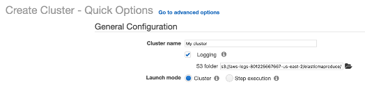
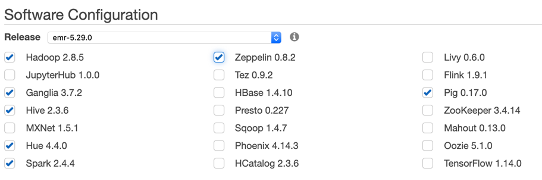
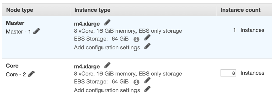
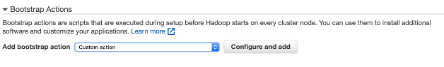
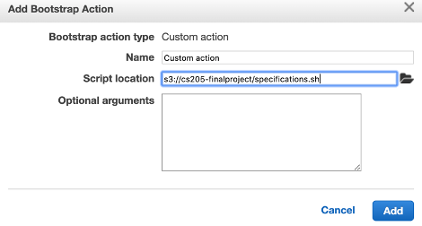
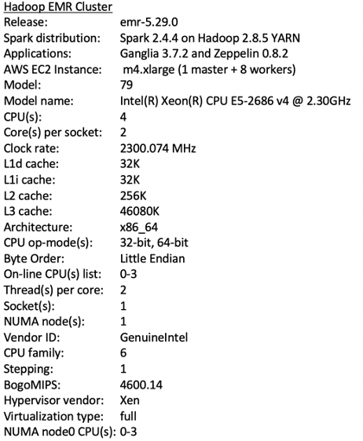

### Real-time Generation of Social Networks in Makerspaces

Makerspaces are hubs of hands-on learning that have become increasingly popular across the globe. These open-ended learning environments enable students to explore new concepts through making, and allow opportunities for students to develop 21st century skills, such as collaboration. Makerspaces are unique because the majority of learning takes place through interactions (either with peers, instructors or tools) as opposed to through lectures and directed instruction (Martin, 2015). While this format of learning is highly effective for some, other students may struggle in the space if they lack opportunities to form these social connections. Thus, it is important for instructors to keep track of which students are effectively connecting with others within the space, and which students may need more support. 

However, this can be difficult for instructors because making often takes place outside of class time. Since Makerspaces are open to students throughout the week, the same instructor may not always be present when students are creating and making within the space. This poses an information aggregation problem since not any one instructor has a full overview of how each student is working. 

Within the literature on open-ended learning environments, Researchers have explored the use of visualization dashboards for instructors. In particular, visualizing social networks of class interactions can help instructors detect isolated networks within the learning environment and foster collaboration beyond the existing boundaries (Shreurs et al., 2013). These studies have generally been conducted on online learning platforms, since information about student and peer interactions can be automatically captured through log and chat data. In this application, we are interested in generating social network data within physical Makerspace environments. Our application will process collected Kinect sensor data over the course of a semester long digital fabrication course. The Kinect sensors are minimally invasive and capture skeletal joint data and positional data for each agent within the space. 

Overall, our application aims to support instructors in an open ended learning environment such as a Makerspace. The main goal of this project is to achieve near-real time data processing of the Kinect data collected during class for social network and tool usage analysis.

#### References: 

Martin, L.: The promise of the maker movement for education. Journal of Pre-College Engineering Education Research (J-PEER) 5(1), 4 (2015).

Schreurs, B., Teplovs, C., Ferguson, R., De Laat, M., & Buckingham Shum, S. (2013, April). Visualizing social learning ties by type and topic: rationale and concept demonstrator. In Proceedings of the Third International Conference on Learning Analytics and Knowledge (pp. 33-37).

### Deployment Steps

The relevant code for our application can be found in the `code` folder. In particular, `spark_streaming.py` implements spark data streaming and python multiprocessing on incoming Kinect data in order for us to visualize the students' social network and tool usage within the course. Windowed operations are included in the code and our application aggregates data from the sensors for the last 30 minutes and updates the outputs every 5 minutes.

To begin, we create a Hadoop Spark Cluster on Amazon AWS using the following steps. Note that a bash file must be uploaded to a S3 bucket for bootstrapping action on the cluster. The purpose of the bash file is to install the necessary packages and dependencies on each of the AWS instance and the `specifications.sh` bash file can be found in the `code` folder.

#### Create Hadoop Spark Cluster

Step 1: Go to the EMR dashboad on Amazon AWS and click create cluster. Click on the `Go to advanced options` link.




Step 2: Select the necessary software configuration as such.




Step 3: Create a cluster of m4.xlarge instances with 1 master and 8 workers.




Step 4: Add a custom bootstrap action so that the necessary packages and dependencies can be installed on each instance.




Step 5: Upload the `specifications.sh` bash file from S3 bucket for bootstrapping.




Step 6: Create the cluster and wait for it to run. Further replicability information on the cluster can be found below.


#### Run Application

Once the cluster is running, we can SSH into the master node and secure copy the necessary file onto the master node using the following commands.

```bash
scp -i ~/.ssh/key.pem data.csv
scp -i ~/.ssh/key.pem calibration.csv
scp -i ~/.ssh/key.pem spark_streaming.py
```

where `key.pem` is the secure key for the cluster, `data.csv` is the data file from the Kinect sensors, `calibration.csv` is the calibration file needed for homography and `spark_streaming.py` is the code file for our application

Once the relevant files are uploaded on the master node, we still need to upload the data and calibration files onto the Hadoop file system using the following commands.

```bash
mkdir data
mv data.csv data
hadoop fs -put data
hadoop fs -put calibration.csv
```

Lastly, we can ran our application using the following command. The outputs will be in a folder called `output_final` in the Hadoop file system.

```bash
spark-submit spark_streaming.py
```

Note that we can change the number of worker instances and cores used by using the following command. In this case, 2 worker instances are deployed with 1 core each.   

```bash
spark-submit --num-executors 2 --executor-cores 1 spark_streaming.py
```

#### Replicability Information




